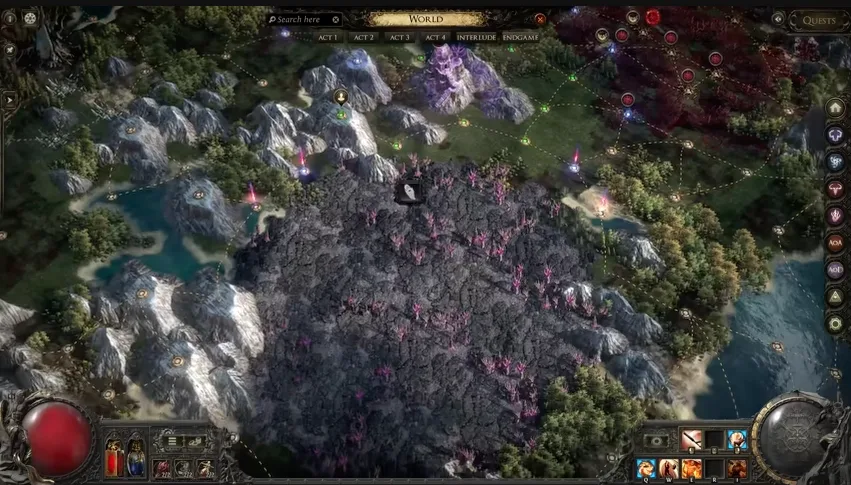

# Breach

Breach gets a new Atlas hub, a revamped passive tree, visible encounter
progress, Genesis Tree crafting, and a longer Breach Domain progression
chain.

## What changed

- Breach has a new hub: **The Monastery of the Keepers**,
south of the Atlas start.
- Maps around the hub always contain Breach and grant Breach Atlas Tree
points.
- The Breach Atlas Passive Tree was completely revamped.
- Starting a Breach now shows a progress bar with remaining time and
kill-based time extension.
- Reaching 100% starts a **Stabilised Breach** with new
challenges at the starting point.

## Genesis Tree crafting

- The new Genesis Tree consumes **Wombgifts** and 
**Hiveblood** to create jewellery, belts, and currency.
- Genesis Tree nodes control what items are crafted, and new nodes
unlock by using Wombgifts.
- Six ring bases, four amulet bases, and four belt bases are exclusive
to the Genesis Tree.
- Catalysts no longer drop from monsters and are now obtained only
through the Genesis Tree.
- Twelve new Catalysts can add new quality modifiers to jewels.

## Domain progression

- Breach monsters now drop Hiveblood, Wombgifts, and Breachstone
Splinters.
- Full Breachstone Splinter stacks become a special Wombgift that
creates a Breachstone at the Genesis Tree.
- Breachstones reveal new Breach Domains on the Atlas.
- Domains contain Breach Hives, Sky Hives, and Sky Fortresses.
- Sky Fortresses contain Tul and Esh; defeating them grants a key to the
Breach pinnacle boss.

