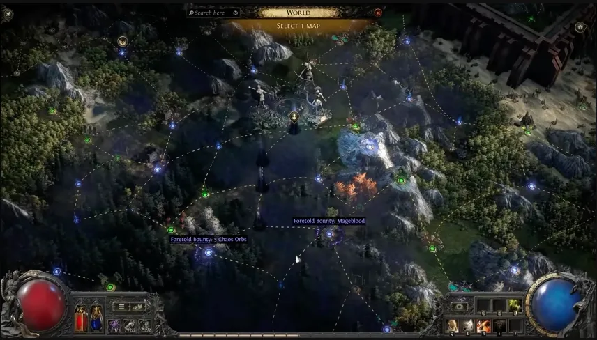

# Ritual

Ritual now has a new Atlas home, a rebuilt tree, cleaner altar flow, more
focused rewards, and a map-chain mechanic that leads to the Ritual
pinnacle boss.

## What changed

- Ritual has a new hub: **Caer Tarth**, west of the Atlas
start.
- Maps around Caer Tarth always contain Ritual and grant Ritual Atlas
Tree points.
- The Ritual Atlas Passive Tree was completely revamped.
- After completing a Ritual Altar, locusts now point toward the next
altar.
- Endgame Ritual reward screens now offer only uniques or omens.

## King and Queen progression

- Unspent Tribute can be sacrificed to gain an 
**Audience with the King**.
- Killing the King in the Mists drops 
**The Head of the King**.
- The Head of the King starts **Rite of the Nameless** in
Caer Tarth.
- Rite of the Nameless asks you to choose five maps that form one
continuous Ritual chain.
- Each map grants one key element for the Ritual pinnacle boss.
- A new boss, **The Queen in the Mists**, can be unlocked
from the Atlas Tree and drops new corrupted Idols.

## Practical notes

- Rite maps after the first gain extra modifiers that affect Ritual
difficulty and rewards.
- Monsters from each Ritual, including map bosses, reappear in later
maps of the chain.
- Freythorn Rituals no longer show deferred items, preventing rewards
from being stranded on higher-level reruns.

