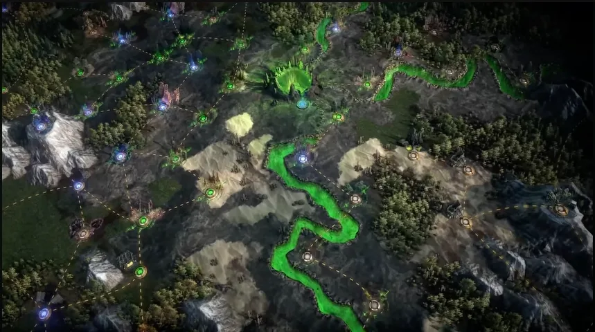

# 深淵

深淵在 v0.5.0
的更新規模較小，但重點明確：更清楚的輿圖裂縫、保證深淵地穴頭目進度，以及重製輿圖天賦樹。

## 改動重點

- 輿圖現在會出現大型深淵裂縫。
- 完成輿圖深淵會關閉這些裂縫。
- 完成輿圖深淵固定給予含頭目戰的**深淵地穴**。
- 深淵輿圖天賦樹重製，加入許多新節點並調整既有節點。
- 骷髏馬克的邀請現在固定分配給地圖擁有者。

## 獎勵與平衡注意事項

- 深淵預兆不再於 65 級以下區域掉落。
- 影響寶箱數量的詞綴現在會套用到深淵寶箱。
- 這些寶箱詞綴也會影響找到深淵地穴的機率，因此更多寶箱不再降低地穴機率。
- 「隕星滅亡」怪物詞綴的傷害已調整。
- 深淵怪物詞綴生成的岩術符文現在會在更長延遲後啟動。

