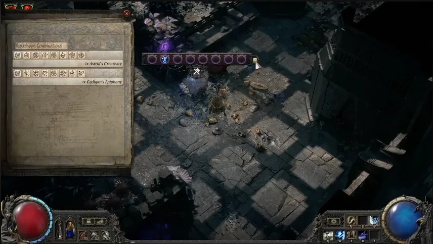

# 阿德爾符文聯盟

**阿德爾符文**是流亡黯道 2 v0.5.0
的挑戰聯盟。每個區域都會出現以製作為核心的遭遇：
選擇遺跡製作、加入符文提高風險與獎勵，擊敗被喚起的怪物後取得成果。

## 核心機制

- 每個區域都有一個**遺跡**，可把符文配方刻進可用欄位。
- 遺跡可有 **2 到 10 個欄位**
；欄位越多越稀有，也能做出更強製作。
- 每加入一個額外符文形狀，就會增加一波敵人與更多符文詞綴。
- 這些怪物會掉落**維里西姆**，用於符文鍛造。
- 新 NPC 法羅會透過四個劇情任務引導並解鎖聯盟功能。

## 符文鍛造解鎖

<table>
<thead>
<tr>
<th>進度</th>
<th>解鎖</th>
<th>用途</th>
</tr>
</thead>
<tbody>
<tr>
<td>第 1 章</td>
<td>維里西姆符文鍛造</td>
<td>消耗維里西姆，替護甲加入符文保護。</td>
</tr>
<tr>
<td>第 2 章</td>
<td>13 種合金</td>
<td>替換現有詞綴，加入專屬製作詞綴。</td>
</tr>
<tr>
<td>第 3 章</td>
<td>傳奇維里西姆符文鍛造</td>
<td>升級低等傳奇武器與護甲基底，讓它們能在高等級使用。</td>
</tr>
<tr>
<td>第 4 章</td>
<td>13 種上古符文</td>
<td>提供各武器類型專屬的強力加成。</td>
</tr>
</tbody>
</table>

## 符文保護

符文保護是符文鍛造帶來的新防禦層。生命降到 1
後，它會在你死亡前承受傷害，並獨立於生命恢復。 低於物品等級 55
的護甲可無代價獲得符文保護；高等護甲則會用一部分原本基礎防禦交換符文保護。

## 卡爾葛寶石

遺跡可製作新的卡爾葛寶石組合：**23 個主動技能**與
**7 個輔助**。
這些技能多圍繞保護消耗、保護互動、維里西姆、召喚物、符文與爆發轉化。

- **主動技能例子：**Animus Exchange、Bitter
Dead、Conductive Runes、Detonate Living、Frostflame Nova、Grim
Pillars、Hollow Shell、Rain of Blades、Runic
Reprieve、Skyfall、Verisium Manifestations、Voltaic Barrier、Wardbound
Minions。
- **輔助寶石例子：**Concussive Runes、Fist of
Kalguur、Healing Runes、Runeforged Blades、Runic Extraction、Runic
Infusion、Scouring Flame。

## 探險整合

本聯盟中，探險被整合進阿德爾符文。日誌書改為海洋探索系統，阿德爾符文的樞紐是
**王墓廢墟**
；梅德維德、沃拉娜、烏特雷德與奧爾羅斯會成為新島嶼上的陣營首領。
擊敗奧爾羅斯可取得通往阿德爾符文巔峰頭目的鑰匙。

