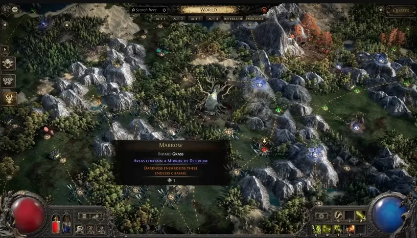

# 譫妄

譫妄在 v0.5.0
獲得更清楚的輿圖定位、固定任務進度、重製天賦樹，以及通往專屬巔峰頭目的新升級機制。

## 改動重點

- 譫妄有新的輿圖樞紐：位於起點西南方的**凋萎柳樹**。
- 樞紐周圍地圖固定含有譫妄，並給予譫妄輿圖天賦點。
- 譫妄輿圖天賦樹完整重製，加入新節點並調整既有節點。
- 觸發譫妄之鏡後，新的進度條會顯示霧中深度與剩餘時間。
- 霧的方向會指向地圖頭目，譫妄地圖頭目固定為 100% 譫妄。

## 新進度

- 譫妄進度條特定深度會出現新的鏡片遭遇。
- 完成譫妄之鏡後，有機會在附近輿圖地圖生成**宏偉之鏡**。
- 宏偉之鏡會複製地圖頭目；擊殺兩個頭目可解鎖**瘋狂試煉**。
- 瘋狂試煉會從你選定的地圖擴散迷霧，擊殺稀有怪與頭目提高譫妄程度，達
100% 後開啟幻像輿圖。
- 幻像輿圖改為 7 波遭遇，完成後會給予通往譫妄巔峰頭目的鑰匙。

## 值得注意的獎勵

- 厭惡泥沼可掉落兩種新項鍊基底，提供兩個灌注核心天賦，但會犧牲前綴或後綴。
- 液態情感可用來製作珠寶詞綴，效果類似高階精髓。
- 強效情感可加入強力珠寶詞綴，也能灌注一般天賦樹上不存在的新核心天賦。
- 部分非項鍊譫妄傳奇可帶有渡鴉之觸，使它們能被灌注。

