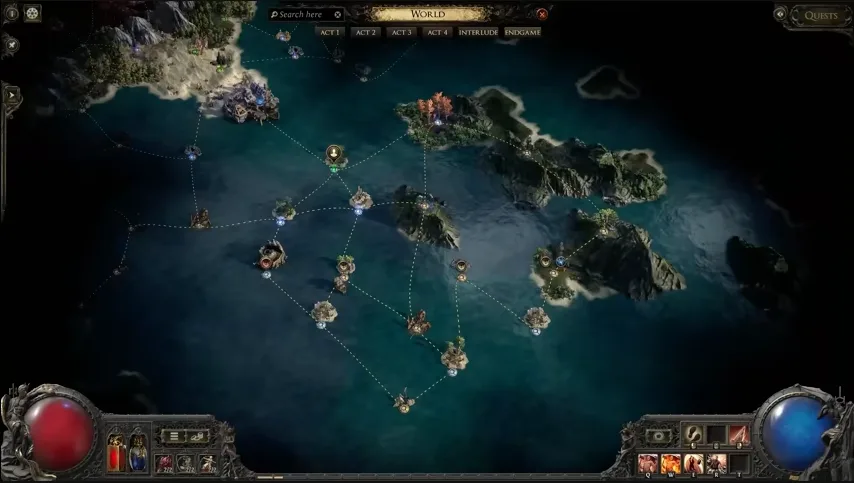

# 探險

探險在 v0.5.0
聯盟期間暫時整合進阿德爾符文；舊版獨立標準模式實作會先停用，之後再重新整合。

## 阿德爾符文整合

- 探險遺跡已改為阿德爾符文的遺跡。
- 日誌書現在改為海洋探索機制。
- 使用日誌書會揭露可探索的海域與島嶼。
- 梅德維德、沃拉娜、烏特雷德與奧爾羅斯會作為四位陣營首領出現在新島嶼。
- 擊敗奧爾羅斯會給予通往阿德爾符文巔峰頭目的鑰匙。

## 暫時移除

- 由於整合進阿德爾符文，探險在標準聯盟中暫時停用。
- 重組器已停用。
- 重組預兆已移除，既有物品會在登入時刪除。
- 「被時間遺忘」探險先驅碑牌暫時不會掉落。
- 舊版探險通貨可賣給商人換取金幣。

## 便利性改動

- 探險炸藥現在會等前一個炸藥挖出的多數怪物死亡後才引爆。
- 可以直接使用倉庫中的通貨向探險商人購買物品。
- 多種探險通貨已從通貨交易所移除。
- 舊藏身處中的羅格、關南、丹尼格與圖金會轉為不可互動裝飾物。
- 可使用 <code>/reclaimexpeditioninventories</code> 
取回停用探險庫存中的物品。

